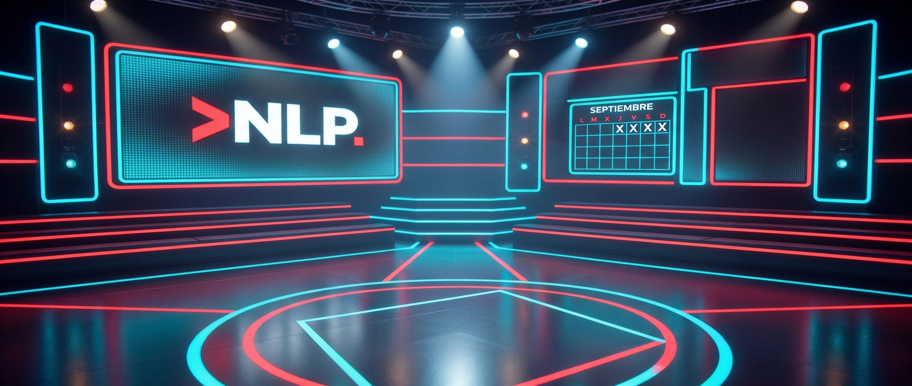
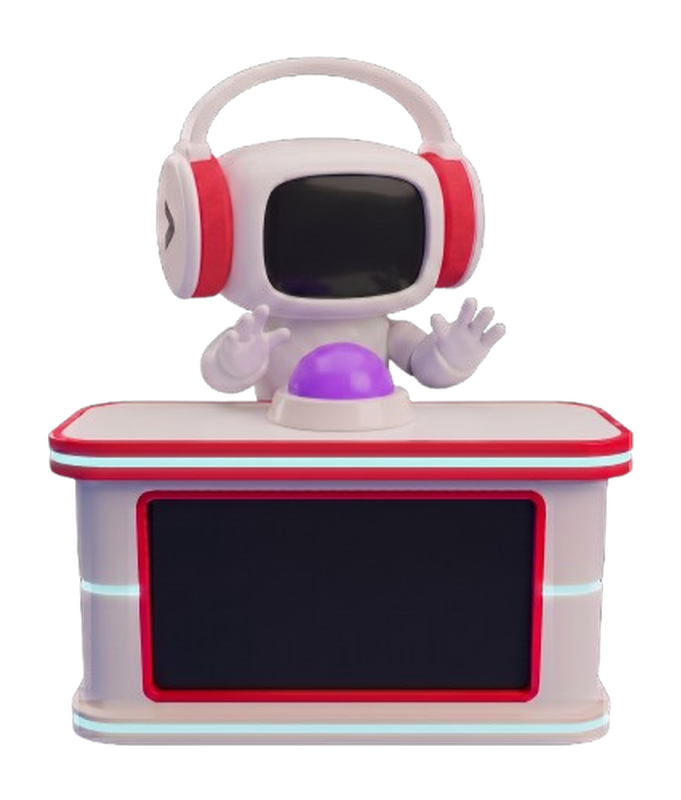

# 🎮 Kacho Contest System — DEMO

### «Atrápame el Bit» — simulador online del sistema de pulsadores

*No es una maqueta ni una captura: es **la web real** del proyecto funcionando en su **modo DEMO**,
sin servidor y sin hardware. Dos pestañas se hablan entre sí y el concurso cobra vida.* 🧠⚡

   

Los napis del escenario — cada jugador tiene el suyo 🎭

---

## 🚀 Pruébalo ahora (sin instalar nada)

  <a href="https://ea2oy.github.io/KachoContestSystem-demo/" target="_blank" rel="noopener">
    <strong>👉 Abrir la DEMO online (pestaña nueva) 🎮</strong>
  </a>

| Paso | Qué hacer |
|---|---|
| 1️⃣ | Abre el enlace de arriba |
| 2️⃣ | Escribe el PIN **`134679`** y elige destino |
| 3️⃣ | Abre **DOS pestañas del mismo navegador**: una como **Panel del super** (*Ajustes*) y otra como **Pantalla de proyección** |
| 4️⃣ | ¡A jugar! Lanza preguntas, pulsa con los botones **Puls**, juzga con **Verdad/Falso**, prueba rebotes, modos **Puntos/Vidas**, el editor de layout y los sonidos |

- 🕹️ **La gracia está en las dos pestañas**: son el panel del super y la pantalla del público,
  sincronizadas en vivo (una lanza, la otra canta).
- 🔊 **El sonido suena en la ventana de proyección** (el panel es mudo a propósito, como el real).
  El navegador pide un toque en pantalla la primera vez para desbloquear el audio.
- 🎲 **El modo DEMO se activa solo** al servirse desde GitHub Pages (o con `?demo=1` en la URL).

## ✨ ¿Qué trae la DEMO?

Es el sistema completo, con la **batería real de 288 preguntas** y los ajustes de verdad
(nombres, colores, napis y puntos del sistema original):

| | |
|---|---|
| 🎮 **4 jugadores** | Nombres, colores, napis, ±1 punto y botón **Puls** para simular cada pulsador |
| ⏱️ **Segundero** | Tiempo de reacción de cada jugador desde que sale la pregunta |
| 🔁 **Turnos y rebotes** | Rebote manual, por tiempo y encolado de pulsaciones (1º, 2º, 3º, 4º) |
| ✅ **Verdadero / Falso** | Tú eres el juez: aciertos con aplausos y explicación, fallos con X neón |
| ❤️ **Modo Vidas** | Quita vidas a la víctima; 0 vidas = eliminado (o modo Puntos clásico) |
| 📝 **Batería de preguntas** | Añadir, editar, borrar, mover, filtrar, marcar usadas y **▶ Siguiente** |
| 🔊 **Sonidos** | Chiptune + banco de pruebas (quack incluido 😜) |
| 🎬 **Animaciones** | 13+ animaciones de rearme con textos graciosos, confeti y focos |
| 🖼️ **Editor de layout** | Mueve, escala y ajusta cada elemento del escenario en vivo |
| 🗒️ **Log de rondas** | Todo lo que pasa queda registrado y se ve en el panel |

## 💾 Editable y persistente (en tu navegador)

El modo DEMO se comporta como el sistema real y **guarda los cambios en `localStorage`**, así que
sobreviven a las recargas:

- **Preguntas**: añadir, editar, borrar, mover, marcar usadas (✓/↩), **▶ Siguiente**, pegar texto
  y **subir un `.txt`**.
- **Jugadores y configuración**: nombres, colores, puntos/vidas, modos y toggles.
- **Layout**: posiciones y tamaños del escenario.

> 🔄 **Para volver a la batería original**: borra los datos del sitio (DevTools → Application →
> Clear site data) o pulsa *Vaciar batería* y recarga.

## ⚠️ Qué NO hace (es un simulador, y lo dice claro)

| Límite | Por qué |
|---|---|
| ❌ Sin pulsadores físicos, luces, OLED ni LED RGB | No hay hardware: eso vive en la placa ESP32-S3 |
| ❌ Sin sincronía **entre dispositivos** | Solo entre pestañas del **mismo** navegador (BroadcastChannel) |
| ❌ Sin subida de MP3 ni de imágenes de animación | No hay servidor de archivos en GitHub Pages |
| ❌ Sin WiFi propio ni botones físicos de la placa | Funciones del firmware, no de la web |

## 🎲 Cómo se juega (en 30 segundos)

1. El super lanza una pregunta desde el panel (con animación y sonido) 🎬
2. Los concursantes pulsan: primero en llegar, primero en responder 🎮
3. El super juzga con **Verdad** (aplausos + explicación) o **Falso** (X) ✅❌
4. Si nadie acierta, el rebote pasa el turno al siguiente… o se reabre la ronda 🔁
5. ¿Modo Vidas? Cada acierto quita una vida a la víctima que elija el super ❤️💀

## 🧩 El proyecto real (la placa)

Este repo es una **copia de la carpeta `web/`** del proyecto **Kacho Contest System**: firmware
ESP32-S3 + web para el concurso de pulsadores de la
[**Navarra LAN Party**](https://navarralanparty.org). En el sistema real:

- 🔌 **Todo vive en un ESP32-S3** (16 MB flash · 8 MB PSRAM): la placa sirve la web, escucha los
  4 pulsadores, canta los turnos, reparte rebotes y lanza las animaciones.
- 📡 **WiFi propio (AP) o red del evento (STA)** — funciona con o sin router.
- 💡 **Hardware**: pulsadores en GPIO 4-7, luces de turno en 15-18, botones de quitar pregunta /
  rebote / rearme en 8-10, OLED I2C (41/42) y LED RGB WS2812 (48).
- 📘 **Manuales completos** (uso del super + montaje técnico) y guías de arquitectura en el
  repositorio principal, que es **privado**.

> 🔒 El repositorio del proyecto real es privado (su memoria de desarrollo contiene credenciales de
> pruebas). Este demo se publica aparte, solo con la web.

---

**Hecho con ❤️ y mucho café por Kacho (EA2OY) para la Navarra LAN Party**

 

*MIT License © 2026 Tai Soluciones*

